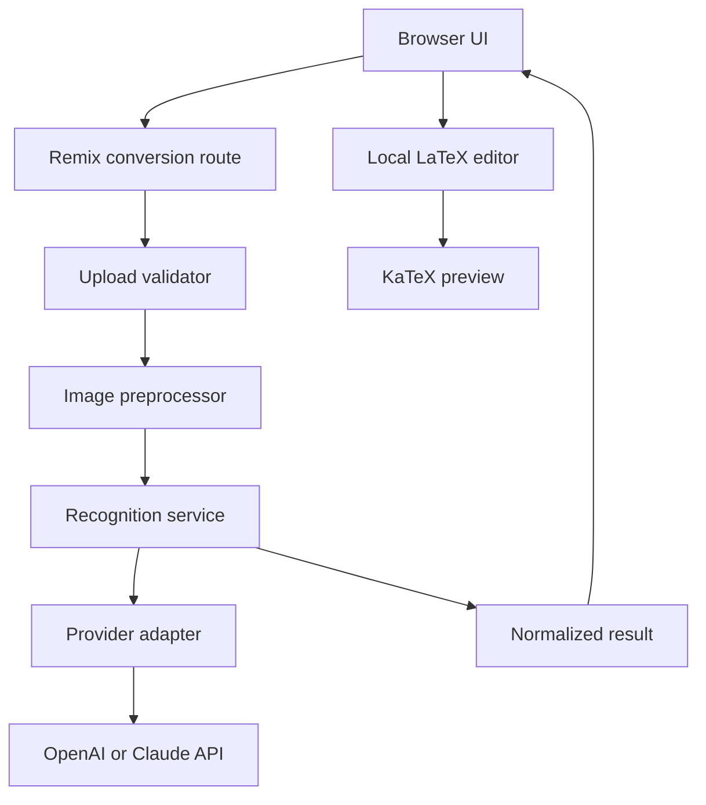
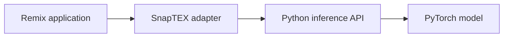

# SnapTEX Architecture

## Status

This document defines the initial architecture for SnapTEX. The first release will be a modular full-stack monolith with a provider-independent equation-recognition boundary.

The core product flow is:

```text
image upload -> validation -> recognition -> editable LaTeX -> live preview -> copy
```

## Goals

- Convert images of mathematical equations into clean, editable LaTeX.
- Render returned LaTeX immediately in the browser.
- Keep the first version small enough to implement and test quickly.
- Allow OpenAI or Claude to provide recognition initially.
- Allow the API provider to be replaced later by the native SnapTEX model without changing the frontend or upload API.

## Initial technology decisions

| Concern | Decision |
| --- | --- |
| Full-stack framework | Remix with TypeScript |
| Runtime | Node.js |
| Styling | Tailwind CSS |
| LaTeX rendering | KaTeX |
| Upload format | `multipart/form-data` |
| API response | Typed JSON |
| Initial recognizer | OpenAI or Claude adapter |
| Future recognizer | Python inference service |
| Database | None for the MVP |
| Image storage | None; process in memory and discard |
| Authentication | None for the MVP |
| Client state | React state and Remix fetchers |

Deployment will be selected after the local MVP is working.

## System overview



## Responsibilities

### Frontend

The browser is responsible for:

- selecting or dropping an equation image;
- displaying a local image preview;
- submitting the image and showing upload state;
- placing returned LaTeX in an editable field;
- rendering edits locally with KaTeX;
- copying LaTeX to the clipboard;
- displaying ambiguity warnings and retry controls.

Editing and previewing LaTeX must not make additional recognition requests.

### Conversion route

The Remix conversion route is responsible only for HTTP concerns:

- accepting `POST` requests;
- reading `multipart/form-data`;
- invoking the conversion service;
- mapping application errors to HTTP responses;
- returning typed JSON.

The route must not contain provider-specific AI logic.

### Conversion service

The conversion service coordinates the application workflow:

```text
validate -> preprocess -> recognize -> normalize -> return
```

This service is independent of OpenAI, Claude, or the future SnapTEX model.

### Recognition layer

Every recognition provider implements the same contract:

```ts
interface EquationRecognizer {
  recognize(image: EquationImage): Promise<ConversionResult>;
}
```

Provider-specific authentication, prompts, request formatting, and response parsing remain inside the provider adapter.

The active provider is selected through configuration:

```env
RECOGNITION_PROVIDER=openai
```

Supported values will eventually be:

- `openai`
- `claude`
- `snaptex`

## Proposed repository structure

Directories and files should be created as their corresponding features are implemented. Empty placeholders are unnecessary.

```text
app/
├── components/
│   ├── EquationUploader.tsx
│   ├── ImagePreview.tsx
│   ├── LatexEditor.tsx
│   ├── LatexPreview.tsx
│   ├── ConversionResult.tsx
│   └── ErrorMessage.tsx
├── routes/
│   ├── _index.tsx
│   └── api.convert.ts
├── recognition/
│   ├── types.ts
│   ├── recognizer.server.ts
│   ├── openai-recognizer.server.ts
│   ├── claude-recognizer.server.ts
│   └── prompts.ts
├── services/
│   └── conversion-service.server.ts
├── schemas/
│   └── conversion.ts
├── utils/
│   ├── image-validation.server.ts
│   ├── image-preprocessing.server.ts
│   └── errors.server.ts
├── root.tsx
└── entry.server.tsx

tests/
├── fixtures/
├── unit/
├── integration/
└── evaluation/
```

## API contract

### Request

```http
POST /api/convert
Content-Type: multipart/form-data
```

The image is submitted under the `image` form field.

Supported initial formats:

- PNG
- JPEG
- WebP

The initial maximum upload size will be 8 MB.

### Successful response

```json
{
  "success": true,
  "result": {
    "latex": "\\frac{-b \\pm \\sqrt{b^2-4ac}}{2a}",
    "confidence": null,
    "warnings": [],
    "provider": "openai"
  }
}
```

`confidence` is nullable because general-purpose API models do not return calibrated OCR confidence. The future SnapTEX model may provide a meaningful confidence value.

### Error response

```json
{
  "success": false,
  "error": {
    "code": "RECOGNITION_FAILED",
    "message": "The equation could not be recognized."
  }
}
```

## Domain types

```ts
type EquationImage = {
  bytes: Uint8Array;
  mimeType: "image/png" | "image/jpeg" | "image/webp";
};

type ConversionWarning = {
  code:
    | "AMBIGUOUS_SYMBOL"
    | "UNREADABLE_REGION"
    | "MULTIPLE_EQUATIONS";
  message: string;
};

type ConversionResult = {
  latex: string;
  confidence: number | null;
  warnings: ConversionWarning[];
  provider: string;
};
```

## Error taxonomy

| Code | HTTP status | Meaning |
| --- | ---: | --- |
| `IMAGE_REQUIRED` | 400 | No file was submitted |
| `EMPTY_IMAGE` | 400 | The submitted file is empty |
| `UNSUPPORTED_IMAGE_TYPE` | 415 | The file is not PNG, JPEG, or WebP |
| `IMAGE_TOO_LARGE` | 413 | The upload exceeds the size limit |
| `RECOGNITION_FAILED` | 502 | The upstream recognizer failed |
| `INVALID_MODEL_OUTPUT` | 502 | The recognizer returned unusable output |
| `RATE_LIMITED` | 429 | An application or provider limit was reached |
| `INTERNAL_ERROR` | 500 | An unexpected backend failure occurred |

External provider details and credentials must never be returned to the browser.

## Image-processing policy

For the MVP:

- validate image type and size;
- process the image in memory;
- discard the original after conversion;
- preserve its aspect ratio;
- correct metadata-based rotation when necessary;
- avoid aggressive cropping or thresholding.

Image preprocessing remains a separate module even if its first implementation returns the original image. The native model may later require grayscale conversion, contrast normalization, deskewing, equation-region detection, resizing, or padding.

## Future native model

The eventual custom model will be developed and served separately from the Remix application:



The Remix application will call an internal inference endpoint through `SnapTeXRecognizer`. Because it implements the existing recognition interface, the upload route and frontend will remain unchanged.

## Testing boundaries

The initial backend should verify:

- missing uploads;
- empty files;
- unsupported MIME types;
- oversized images;
- valid recognition responses;
- malformed provider responses;
- upstream provider failures;
- normalization of successful results.

A separate evaluation suite will later compare recognition quality using compilation success, normalized exact match, edit distance, rendered similarity, latency, and cost.

## Deferred features

The MVP deliberately excludes:

- accounts and authentication;
- conversion history;
- a relational database;
- cloud object storage;
- queues and WebSockets;
- payment processing;
- direct Overleaf integration;
- permanent image retention;
- model-training code inside the web application.

These features should be considered only after the core image-to-LaTeX loop works reliably.
